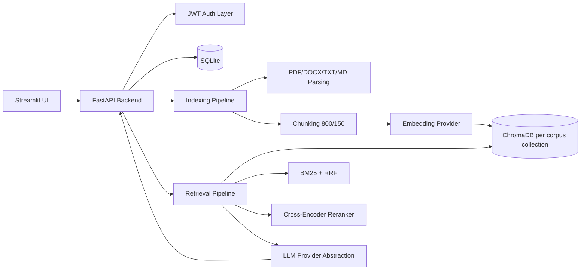

# Domain Knowledge Co-Pilot

Production-ready full-stack RAG application to upload private documents and chat with grounded citations.

## Features
- JWT authentication with per-user data isolation
- Multiple corpora per user
- File uploads: PDF, DOCX, TXT, Markdown
- ChromaDB vector indexing with metadata
- Hybrid retrieval: semantic + BM25 + RRF + cross-encoder reranking
- Query rewriting for ambiguous user questions
- Conversational memory (last 5 turns)
- Persistent chat sessions and message history
- Streamlit chat UI with citations and debug panel
- Dockerized backend + frontend
- Pytest test suite

## Stack
- Frontend: Streamlit
- Backend: FastAPI, SQLAlchemy, Alembic-ready structure, Pydantic
- Auth: JWT (python-jose), Passlib bcrypt
- RAG: ChromaDB, rank-bm25, sentence-transformers, OpenAI/Groq provider abstraction
- DB: SQLite

## Project Structure
```text
domain-knowledge-copilot/
  backend/
    app/
      auth/
      models/
      rag/
      routes/
      schemas/
      services/
      utils/
      main.py
    tests/
    requirements.txt
    main.py
  frontend/
    app.py
    requirements.txt
  database/
  uploads/
  docker/
    Dockerfile.backend
    Dockerfile.frontend
  docker-compose.yml
  .env.example
  README.md
```

## Architecture Diagram


## Environment Variables
Copy `.env.example` to `.env` and update values.

- `DATABASE_URL`
- `JWT_SECRET`
- `JWT_ALGORITHM`
- `JWT_EXPIRE_MINUTES`
- `OPENAI_API_KEY`
- `GROQ_API_KEY`
- `CHROMA_PATH`
- `UPLOADS_DIR`
- `EMBEDDING_PROVIDER` (`openai` or `sentence_transformers`)
- `LLM_PROVIDER` (`groq` or `openai`)
- `BACKEND_URL` (frontend only)

## Local Setup
1. Create `.env` from `.env.example`.
2. Backend:
```bash
cd backend
pip install -r requirements.txt
python main.py
```
3. Frontend:
```bash
cd frontend
pip install -r requirements.txt
streamlit run app.py
```
4. Open:
- API: `http://localhost:8000/docs`
- UI: `http://localhost:8501`

## Docker Deployment
```bash
docker compose up --build
```

Services:
- Backend: `http://localhost:8000`
- Frontend: `http://localhost:8501`

Persistent volumes are mapped to:
- `./uploads`
- `./database` (SQLite + Chroma data)

## API Examples
### Register
```bash
curl -X POST http://localhost:8000/auth/register \
  -H "Content-Type: application/json" \
  -d '{"email":"me@example.com","username":"me","password":"secret123"}'
```

### Login
```bash
curl -X POST http://localhost:8000/auth/login \
  -H "Content-Type: application/json" \
  -d '{"username":"me","password":"secret123"}'
```

### Create corpus
```bash
curl -X POST http://localhost:8000/corpora \
  -H "Authorization: Bearer <TOKEN>" \
  -H "Content-Type: application/json" \
  -d '{"name":"K8s Docs","description":"Internal runbooks"}'
```

### Upload file
```bash
curl -X POST http://localhost:8000/corpora/1/upload \
  -H "Authorization: Bearer <TOKEN>" \
  -F "file=@report.pdf"
```

### Query corpus
```bash
curl -X POST http://localhost:8000/corpora/1/query \
  -H "Authorization: Bearer <TOKEN>" \
  -H "Content-Type: application/json" \
  -d '{"question":"What does it say about latency?"}'
```

## Testing
```bash
cd backend
pytest -q
```

## Database Migrations (Alembic)
```bash
cd backend
alembic upgrade head
```

Create a new migration:
```bash
cd backend
alembic revision --autogenerate -m "describe change"
```

Covers:
- Authentication
- Corpus CRUD
- Upload endpoint
- Retrieval citation serialization
- Query endpoint
- Chat history

## Screenshots
Add screenshots here after running the UI:
- Login/Register sidebar
- Corpus upload workflow
- Chat answer with citation expanders
- Debug panel with retrieved chunks and scores

## Troubleshooting
- `401 Invalid JWT`: ensure `Authorization: Bearer <token>` is set.
- `Unsupported file type`: upload only PDF, DOCX, TXT, MD.
- Empty retrieval results: verify file parsed correctly and indexing succeeded.
- Chroma or model errors: ensure write access to `CHROMA_PATH` and internet/model access for first download.
- LLM failures: set `GROQ_API_KEY` or `OPENAI_API_KEY` and choose matching `LLM_PROVIDER`.

## Notes
- One Chroma collection is created per corpus (`corpus_<id>`).
- Each chunk stores metadata: source file, page, chunk id, upload timestamp.
- Fallback logic: primary provider fails, secondary provider is attempted.
